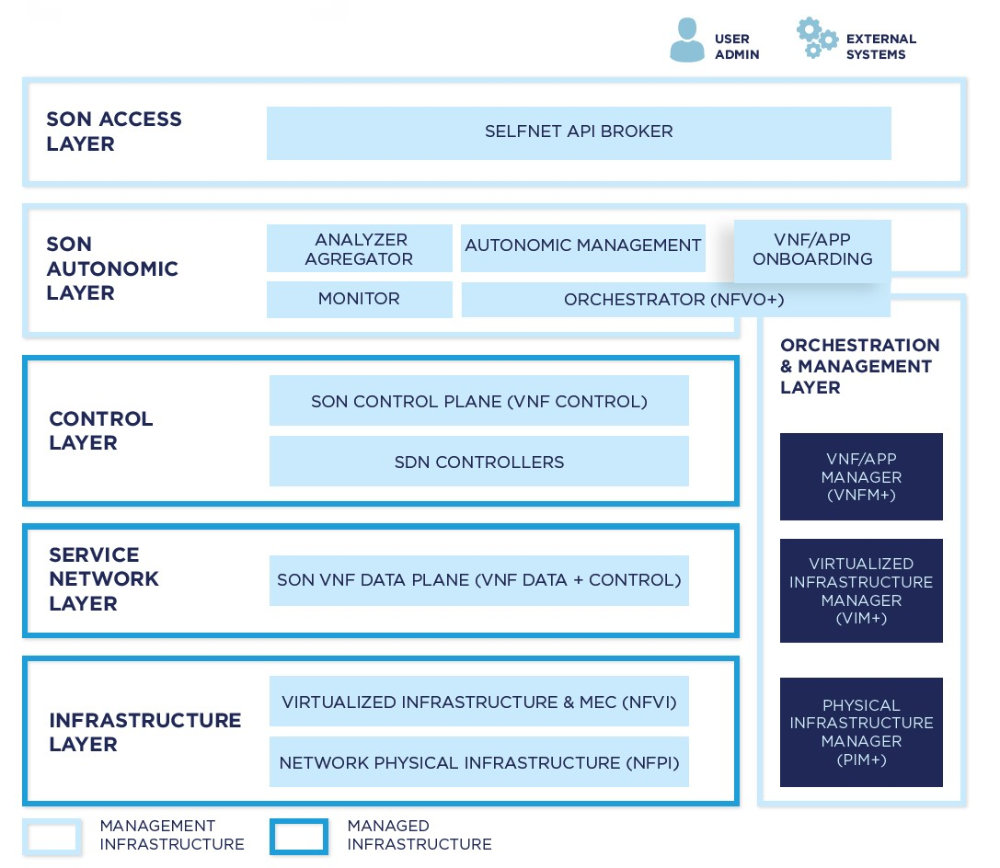

# SELFNET Architecture

SELFNET intends to provide Self-Organising capabilities over 5G networks by means of an architecture based on six differentiated layers.

## Infrastructure Layer

This layer provides the resources required for the instantiation of virtual functions (Compute, Network and Storage) and supports the mechanisms for that instantiation. All network functions managed autonomously by the SELFNET framework will be based on this infrastructure. To achieve its functionality, this layer encompasses different sublayers. The Physical sublayer provides physical connectivity, networking, and computation and storage capabilities over bare metal. The Virtualization sublayer provides virtualization capabilities to instantiate virtual infrastructures. Cloud Computing sublayer provides multi-tenancy support to the infrastructure layer together with a centralised point for facilitating the management of the infrastructure.

### Components

## Virtualized Network Layer

This layer represents the instantiation of the Virtual Networking Infrastructures created by the users of the infrastructure as part of their normal operational plan and those created by the SELFNET framework as part of the SON capabilities. In the context of SELFNET, all Network Functions will be virtual functions and they will be chained across the virtual network topology.

### Components

## SON Control Layer

This layer contains the applications that will enable the collection of data from sensors deployed through the entire system (SON Sensors) and the applications that will be responsible for enforcing actions into the Network (SON Actuators) as part of the enabling mechanisms to provide network intelligence in 5G networks.

### Components

## SON Autonomic Layer

This layer provides the mechanisms to provide network intelligence. The layer collects from the network pertinent information about the network behaviour, uses that information to diagnose the network condition, and decides what must be done to accomplish the system goals. It then guarantees the organised enforcement of the actions that are determined.

### Components

## NFV Orchestration & Management Layer

It is worth emphasising that the control of the chaining of the NF applications is envisioned as a management functionality to be able to control the topology of the Virtual Network layer depicted in the figure as Network Controller (SDN App) and included logically in the VIM functionalities.

### Components

## SON Access Layer

This layer encompasses the interface functions that are exposed by the framework. Despite the fact that internal components may have specific interfaces for the particular scope of their functions, these components contribute to a general SON API that exposes all aspects of the autonomic framework, which are “used” by external actors, like Business Support Systems or Operational Support Systems.
A GUI is also provided on top of the SON API where a network administrator can interact and configure SELFNET and also obtain the complete status of the network, acting as a command and control centre. This GUI will also enable the network administrator to stop, verify or manually enforce any of the actions that SELFNET is governing, allowing always network administrators to have control over their infrastructure.

### Components

* [API Broker](https://github.com/Selfnet-5G/NBI) - Acting as the SELFNET's Northbound interface the API broker collects information from other SELFNET components
* [GUI](https://github.com/Selfnet-5G/GUI) - SELFNET's component that present a visual representation of SELFNET's status

## Use Cases

SELFNET's architecture and Self-Organizing capabilities are demonstrated through three different [use cases](../Use%20Cases).

