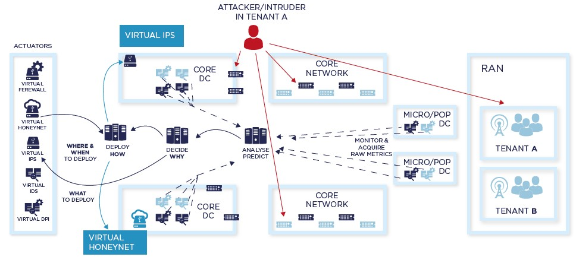
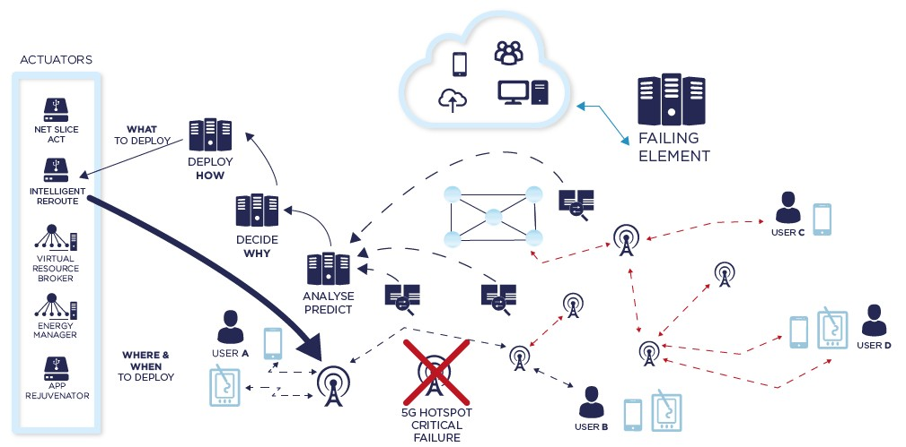
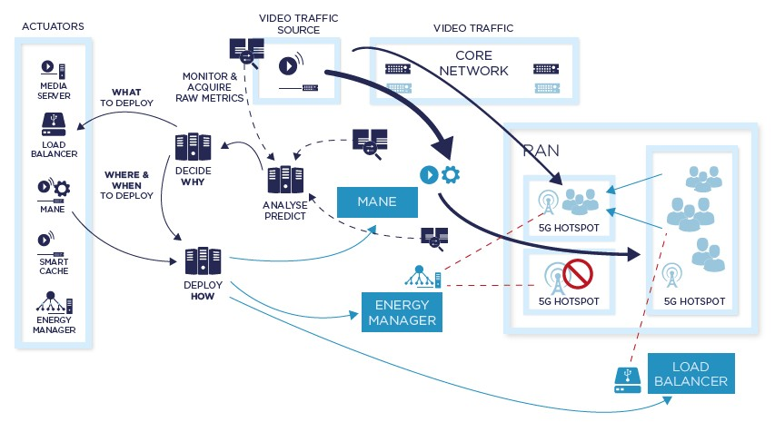
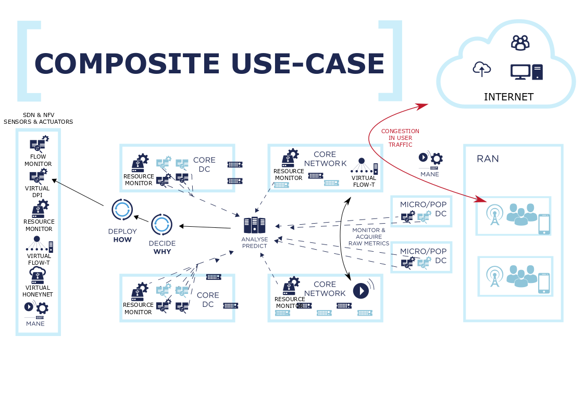

# SELFNET Use Cases

SELFNET intends to provide Self-organising capabilities over 5G networks,

* SELF-PROTECTION - Capabilities against distributed cyber-attacks
* SELF-HEALING - Capabilities against network failures
* SELF-OPTIMISATION - Capabilities to dynamically improve the performance of the network and the QoE of the users.

## Self-Protection

*GOAL*: Detect and mitigate effects of cyber-attacks and restore 5G network traffic to a steady state of security.

*HOW*: VNFs (virtual Traffic monitor/DPI, virtual Threat Management System, virtual honeynets, virtual Intrusion Protection System) deployed and chained at different locations of the network (e.g., at the mobile access, PoP or in the core).

*INNOVATIONS*
* New way of deploying multi-tenant security services distributed across edge and core 5G networks.
* New business opportunities for network and service providers (security as a service).

### Components

## Self-Healing

*GOAL*: Detect and predict common failures/malfunctioning in 5G network infrastructure (hw/sw failures, infrastructure/operation vulnerabilities or power supply interruptions) to apply reactive or preventive recovery.

*HOW*: Self-healing analyzer to infer Health of Network metrics coupled with self-healing diagnosis intelligence to derive potential problems. Decision making intelligence to realise proactive healing responses.

*INNOVATIONS*:
* Intelligent management capabilities to improve the QoE/QoS of 5G systems.
* Infrastructure metrics and SLAs indicators to infer HoN metrics and implement context-aware decisions in 5G Control Plane.

### Components

## Self-Optimization

*GOAL*: Autonomic behaviors to automatically respond to degradation of QoE levels (either actual or predicted), coupled with end-to-end proactive energy management for optimized resource deployment across the 5G network.

*HOW*: SELFNET monitoring and analysis tools to either observe or predict massive video traffic loads; self-adjusting traffic management mechanisms for reduction of delay and loss in video, placing intelligent encoding and packet marking schemes.

*INNOVATIONS*:
* Sensors, actuators and decision making logic to realize QoE-based video streaming.
* Novel energy monitoring sensors to develop a global view of energy usage across the network.

### Components

## Composed Use Case

This use case aims to provide a complex hybrid use case in which all the previous self-organising functionalities will be integrated and will inter-work together to present a complete scenario where the SELFNET Apps act vertically in solving problems in a coordinated fashion.

### Components

