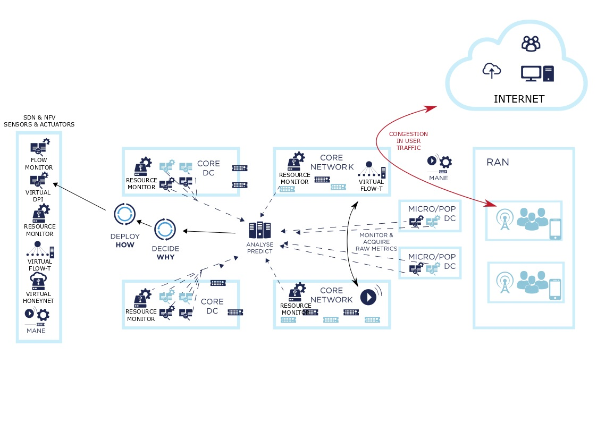

# SELFNET Use Cases

SELFNET intends to provide Self-organising capabilities over 5G networks,

* SELF-PROTECTION - Capabilities against distributed cyber-attacks
* SELF-HEALING - Capabilities against network failures
* SELF-OPTIMISATION - Capabilities to dynamically improve the performance of the network and the QoE of the users.

## Self-Protection

*GOAL*: Detect and mitigate effects of cyber-attacks and restore 5G network traffic to a steady state of security.

*HOW*: VNFs (virtual Traffic monitor/DPI, virtual Threat Management System, virtual honeynets, virtual Intrusion Protection System) deployed and chained at different locations of the network (e.g., at the mobile access, PoP or in the core).

*INNOVATIONS*
* New way of deploying multi-tenant security services distributed across edge and core 5G networks.
* New business opportunities for network and service providers (security as a service).

### Components

* [AIE](https://github.com/Selfnet-5G/Autonomic-Intelligence-Engine) - Generating new Symptom and reaction – SELFNET framework learns as a whole.

* [Command & Control (C&C) Server](https://github.com/Selfnet-5G/Self-Protection-Botnet-Components) - Main component for starting-up a Zeus-based botnet in which recruiting real zombies that can be used to launch remote distributed cyber-attacks.

* [HoneyNet VNF](https://github.com/Selfnet-5G/Self-Protection-Botnet-Components) - Actuator used to build a fully virtualized and personalized honeynet composed of fake zombies to emulate the real zombie's behaviour when requesting malicious actions to the botnet

* [Flow Monitoring Agent](https://github.com/Selfnet-5G/flow-monitoring-agent) - This flow network sensor provides metrics related to all the flows passing trought a given set of network interfaces. These metrics are used in the autonomoic layer in order to infer behaviours over the network flows. This components is able to deal with double encapsultion in order to be ready for 5G flows in a multi-tenant infrastructure. 

* **Snort VNF** - Sensor using a well-known Deep Packet Inspection (DPI) tool such as  Snort for low-level detection, extended with an output plugin to report  alerts in the IDMEF standard format

## Self-Healing

*GOAL*: Detect and predict common failures/malfunctioning in 5G network infrastructure (hw/sw failures, infrastructure/operation vulnerabilities or power supply interruptions) to apply reactive or preventive recovery.

*HOW*: Self-healing analyzer to infer Health of Network metrics coupled with self-healing diagnosis intelligence to derive potential problems. Decision making intelligence to realise proactive healing responses.

*INNOVATIONS*:
* Intelligent management capabilities to improve the QoE/QoS of 5G systems.
* Infrastructure metrics and SLAs indicators to infer HoN metrics and implement context-aware decisions in 5G Control Plane.

### Components

* [AIE](https://github.com/Selfnet-5G/Autonomic-Intelligence-Engine) - Auto-encoder based profiling of VNFs – Diagnosis and mitigation of management plane issues.

## Self-Optimization

*GOAL*: Autonomic behaviors to automatically respond to degradation of QoE levels (either actual or predicted), coupled with end-to-end proactive energy management for optimized resource deployment across the 5G network.

*HOW*: SELFNET monitoring and analysis tools to either observe or predict massive video traffic loads; self-adjusting traffic management mechanisms for reduction of delay and loss in video, placing intelligent encoding and packet marking schemes.

*INNOVATIONS*:
* Sensors, actuators and decision making logic to realize QoE-based video streaming.
* Novel energy monitoring sensors to develop a global view of energy usage across the network.

### Components

* [Flow Monitoring Agent](https://github.com/Selfnet-5G/flow-monitoring-agent) - This flow network sensor provides metrics related to all the flows passing trought a given set of network interfaces. These metrics are used in the autonomoic layer in order to infer behaviours over the video flows. This components is able to deal with double encapsultion in order to be ready for 5G flows in a multi-tenant infrastructure. 

* [Primary Video Sensor](https://github.com/Selfnet-5G/primary-video-sensor) - This DPI flow network sensor provides metadata from the videos that are passing on the monitored network interfaces. This metadata is extract form the H265 bitstream in order to provide information to the cognitive layer about the video flows. 

* [Video Player](https://github.com/Selfnet-5G/video-player) - This script is integrated with the well knwon GPAC video player in order to allow the automatic re-sclaing of the Video layer when a drop of a video layer happens. 

* [Video Stramer](https://github.com/Selfnet-5G/video-player) - This script is integrated with the well knwon MP4Box video streamer in order to allow the remote control of the video delivery. It tried to acts as a dummy Content Delivery Network software to server the video streams in this use case. 

* [Flow Control Agent](https://github.com/Selfnet-5G/flow-control-agent) - This software is able to insert rules in the data path in order to drop concrete layers of the video flows traffic. This components is able to deal with double encapsultion in order to be ready for 5G flows in a multi-tenant infrastructure. 

## Composed Use Case

This use case aims to provide a complex hybrid use case in which all the previous self-organising functionalities will be integrated and will inter-work together to present a complete scenario where the SELFNET Apps act vertically in solving problems in a coordinated fashion.

### Components

All the components of this use cases are the sum of the components of all the previous use cases described above. 
